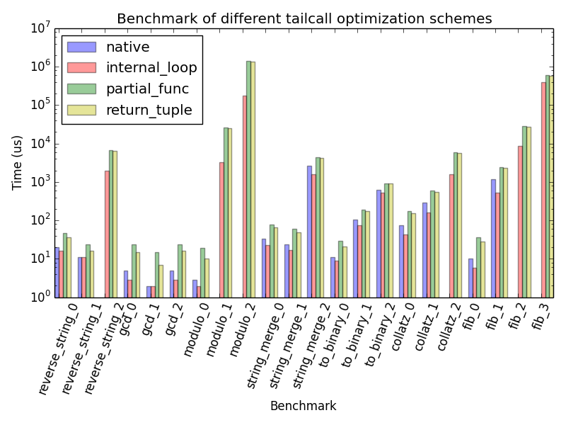

```
Testing all functions work
Testing with N=5 so we can see overheads
fib             : 0.00156784057617 ms/call
fib_unrecursed  : 0.00127983093262 ms/call (1.22503725782x speedup)
partial_func    : 0.0037317276001 ms/call (0.420138001533x speedup)
return_tuple    : 0.00255966186523 ms/call (0.612518628912x speedup)
internal_loop   : 0.000455856323242 ms/call (3.43933054393x speedup)
Testing with N=750 so we can compare with real recursion
fib             : 0.273247718811 ms/call
fib_unrecursed  : 0.101056098938 ms/call (2.70392110603x speedup)
partial_func    : 0.384927749634 ms/call (0.709867550653x speedup)
return_tuple    : 0.352784156799 ms/call (0.774546457217x speedup)
internal_loop   : 0.0800123214722 ms/call (3.41507050144x speedup)
Testing with N=5000 (greater than recursion limit)
fib_unrecursed  : 0.995644569397 ms/call
partial_func    : 2.86069869995 ms/call
return_tuple    : 2.64175891876 ms/call
internal_loop   : 0.862798690796 ms/call
```

(cross posted from http://blog.fastforwardlabs.com/post/117173339298/bytecode-hacking-for-great-justice)

As an exercise into learning more about python 2.7 bytecode, I wanted to
implement the thing that pythonistas [love to hate][guido] - tail call
optimization! This isn't [novel][rubber] at all, but I chose to implement this
only using the standard library so that I could understand more about generating
and modifying bytecode.  As a result, I'm sure there are _many_ edge cases that
I don't consider so please, keep your sys-ops sane and *do not use this code in
production*.  [In the end][pytailcall], even though the code is fun it is a
filthy hack that shouldn't be used in production code and should never be
considered to make it's way into the python source.  One point I really like on
[Guido's blog post][guido] about this issue is tail recursion optimization ruins
the stack traces and detracts from python's ability to debug easily.

Tail calls are when a function is recursing and returns simply on a function
call to itself.  This is different than normal recursion where multiple things
can be happening on our recursed return statement.  So, for example, this is
tail recursion,

```
def factorial(N, result=1):
    if N == 1:
        return result
    return factorial(N-1, N*result)
```

While this is not,

```
def factorial(N):
    if N == 1:
        return 1
    return N * factorial(N-1)
```

So we can see that normal recursion uses the return register in order to
maintain the state of the calculation.  By contrast, tail recursion uses a function
parameter.  This is made particularly simple in python because you can have keyword
arguments with default values to initialize the calculation.

The thing that makes tail calls particularly useful is the ability to optimize
them.  Generally when a function gets called, the system must set up a function
stack in memory that maintains the state of the function, including local
variables and code pointers, so that the function can go on its merry way.
However, when we do a tail recursion we are trying to enter the same function
stack that we are already in, just with changes to the values of the arguments!
This can be quickly optimized by never creating the new function stack and
instead just modifying the argument values and starting the function from the
beginning!

One way of doing this is manually unravelling the recursion.  For our example
above, the factorial would become,

```
def factorial(N, result=1):
    while True:
        if N == 1:
            return result
        N, result = N-1, N*result
```

Not only will this speed up our code, but we also don't have to worry about
those pesky [recursion limits][pyreclimit] that python imposes on us.
Furthermore, the transformation is quite simple.  All we did was add a `while
True:` to the beginning of the function and change any tail calls with changes
to the argument variables.

There are a whole host of methods to do this automatically ([partial
functions][partial], [exceptions][], etc., but I thought it would be fun to do
this by re-writing the bytecode of the function itself.  Let's start by looking
at the actual bytecode of the `factorial` function using the `dis` module from
the standard library.

```
>>> dis.dis(factorial)
# bytecode                                             # relevant python
# -----------------------------------------------------#---------------------
  2           0 LOAD_FAST                0 (N)         # if N == 1:
              3 LOAD_CONST               1 (1)         # 
              6 COMPARE_OP               2 (==)        # 
              9 POP_JUMP_IF_FALSE       16             # 
                                                       # 
  3          12 LOAD_CONST               1 (1)         #    return 1
             15 RETURN_VALUE                           # 
                                                       # 
  4     >>   16 LOAD_GLOBAL              0 (factorial) # return factorial(N-1, N*result)
             19 LOAD_FAST                0 (N)         # 
             22 LOAD_CONST               1 (1)         # 
             25 BINARY_SUBTRACT                        # 
             26 LOAD_FAST                0 (N)         # 
             29 LOAD_FAST                1 (result)    # 
             32 BINARY_MULTIPLY                        # 
             33 CALL_FUNCTION            2             # 
             36 RETURN_VALUE                           # 
```

We can see the full structure of our function in the bytecode.  First we load
up `N` and the constant `1` and compare them using the `COMPARE_OP` bytecode.
If the result if false, we jump to line 16 and if not we load the constant `1`
back into the stack and return it.  On line 16, we first load the reference to
the function named `factorial` (which happens to be the same function we're in!)
and start building up the arguments.  First we load up `N` and `1` and call
`BINARY_SUBTRACT` which will leave the value of `N-1` on the stack.  Then we
load up `N` and `result` and multiply them with `BINARY_MULTIPLY` which will
push the value of `N-1` onto the stack.  By calling the `CALL_FUNCTION`
bytecode (with the argument `2` indicating that there are two arguments to the
function), python can go out and start running the function in another context
until it returns and we can call `RETURN_VALUE` on line 36 to return whatever is
left in the stack. This may seem like a convoluted way of approaching how a
function works (although it [has its uses][hpp]!), but after a while spent
looking at [opcodes][] this starts to make just as much sense as python itself!

In an ideal world, what would we want this bytecode to look like? Looking up
the references on `JUMP_ABSOLUTE`, we can rewrite the above bytecode to be,

```
  2     >>    0 LOAD_FAST                0 (N)
              3 LOAD_CONST               1 (1)
              6 COMPARE_OP               2 (==)
              9 POP_JUMP_IF_FALSE       16

  3          12 LOAD_CONST               1 (1)
             15 RETURN_VALUE        

  4     >>   16 LOAD_FAST                0 (N)
             19 LOAD_CONST               1 (1)
             22 BINARY_SUBTRACT     
             23 LOAD_FAST                0 (N)
             26 LOAD_FAST                1 (result)
             29 BINARY_MULTIPLY     
             30 STORE_FAST               1 (result)
             33 STORE_FAST               0 (N)
             36 JUMP_ABSOLUTE            0
```

The differences here start at line 16.  Instead of loading a reference to the
recursed function, we immediately start filling up the stack with what _were_
the arguments to the function.  Then, once our arguments have been computed,
instead of doing a `CALL_FUNCTION`, we start running a sequence of `STORE_FAST`
to pop the calculated arguments off the stack and into the actual argument
variables.  Now that the arguments have been modified, we can call
`JUMP_ABSOLUTE` with an argument of `0` in order to jump back to the beginning
of the function and starting again.  This last aspect, the `JUMP_ABSOLUTE` back
to the beginning of the function as oppose to setting up a while loop, is one of
the reasons this function is faster than the manual unrolling of the recursion
we did above; we don't need to calculate the conditions of the loop or do any
modifications to our state, we simply start processing opcodes at line 0 again.

This may seem simple, but there are many corner cases that will get you (and in
fact got me in the hours of `SystemError` exceptions I wrestled with).  First of
all, if the recursive return is already within what python calls a block (ie: a
loop or a try..except..finally block), we need to call the `POP_BLOCK` opcode
the right amount of times before our `JUMP_ABSOLUTE` so that we properly
terminate any setup those sections need.

Another problem, and probably much more annoying than the block counts, is that
of changing the size and thus the addresses of the bytecodes.  When bytecode is
represented, it is simply a list of unsigned four-bit integers.  Some of these
integers represent jumps to other points in the list, and it refers to those
other points by either relative offsets (e.g., jump five integers to the right)
or by absolute addresses (e.g., jump to the tenth integer).  In order to make
sure these jumps go to the correct place after we modify the bytecode, we must
keep a list of what we added (and where) and, once our editing is done, go back
through and modify any addresses to again point to the correct place.

Once all these problems are solved, we are left with a [general
decorator][decorator] to transform all of our tail recursion into the iterative
versions!  And this is indeed much faster.  Looking at the benchmark supplied
with [pytailcall][], we can see that we reduce the overhead of recursion (by
eliminating it) and are able to recurse much more than we were previously able
to.

| example          | native           | internal_loop    | partial_func     | return_tuple     |
| ---------------- | ---------------- | ---------------- | ---------------- | ---------------- |
| reverse_string_0 |        9.0599 us |        6.9141 us |       18.8351 us |       17.8814 us |
| reverse_string_1 |        5.9605 us |        5.0068 us |       11.2057 us |        6.9141 us |
| reverse_string_2 | recursion errror |     1002.0733 us |     3272.0566 us |     3123.0450 us |
| gcd_0            |        2.1458 us |        1.9073 us |       10.9673 us |        6.9141 us |
| gcd_1            |        0.9537 us |        0.9537 us |        5.9605 us |        2.8610 us |
| gcd_2            |        1.9073 us |        1.9073 us |       11.9209 us |        6.9141 us |
| modulo_0         |        0.9537 us |        0.9537 us |        7.8678 us |        5.0068 us |
| modulo_1         | recursion errror |     1574.9931 us |    13436.0790 us |    12470.9606 us |
| modulo_2         | recursion errror |    87589.9792 us |   753681.8981 us |   683439.0163 us |
| string_merge_0   |       15.0204 us |       10.0136 us |       35.0475 us |       30.0407 us |
| string_merge_1   |       19.0735 us |       13.8283 us |       26.9413 us |       22.8882 us |
| string_merge_2   |     1231.9088 us |      722.8851 us |     2120.9717 us |     1857.9960 us |
| to_binary_0      |        5.0068 us |        2.8610 us |       12.1593 us |        8.8215 us |
| to_binary_1      |       42.9153 us |       30.9944 us |       81.0623 us |       85.8307 us |
| to_binary_2      |      293.9701 us |      449.8959 us |      447.9885 us |      433.9218 us |
| collatz_0        |       34.8091 us |       20.0272 us |       81.0623 us |       73.9098 us |
| collatz_1        |      131.1302 us |       72.9561 us |      279.9034 us |      331.8787 us |
| collatz_2        | recursion errror |      802.0401 us |     2893.2095 us |     2686.9774 us |
| fib_0            |        4.0531 us |        1.9073 us |       15.0204 us |       10.9673 us |
| fib_1            |      519.0372 us |      236.9881 us |     1118.8984 us |     1122.9515 us |
| fib_2            | recursion errror |     4230.9761 us |    12791.8720 us |    12856.9603 us |
| fib_3            | recursion errror |   192143.9171 us |   298516.0351 us |   292537.9276 us |

In this benchmark, `native` is the original function. `partial_func` is a trick
which wraps the function in a partial and changes it's internal reference to
itself. `return_tuple` is another bytecode hack that changes the recursion into
a specialized return statement that triggers another call to the function.
Finally, `internal_loop` is the bytecode hack described above.

So, by committing this ungodly sin against all things python stands for, we can
get a 33% speedup over python tail recursed code!  In general though, this was a
great exercise in learning much more about how python bytecode works and the
underlying structure of a function.  While this sort of bytecode hacking is
exactly that, a hack, being able to read bytecode and understand the output of
`dis.dis` is incredibly useful when optimizing python code for actual production
systems.  If you want to know more about _that_ aspect of the optimization, and
other more rigorous methods of optimization, check out [High Performance
Python][hpp].




[guido]: http://neopythonic.blogspot.com/2009/04/tail-recursion-elimination.html
[rubber]: http://www.teamrubber.com/blog/python-tail-optimisation-using-byteplay/
[pyreclimit]: https://docs.python.org/2/library/sys.html#sys.setrecursionlimit
[partial]: http://tomforb.es/adding-tail-call-optimization-to-python
[exceptions]: http://lambda-the-ultimate.org/node/1331
[hpp]: http://shop.oreilly.com/product/0636920028963.do
[opcodes]: http://unpyc.sourceforge.net/Opcodes.html
[decorator]: https://github.com/mynameisfiber/pytailcall/blob/master/pytailcall/internal_loop.py#L77
[pytailcall]: https://github.com/mynameisfiber/pytailcall/
